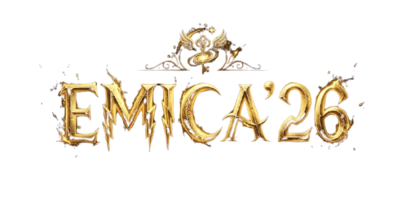

# ✨ EMICA'26 — National Level Technical Symposium

<div align="center">



**A cinematic, magical landing page for EMICA'26 — National Level Technical Symposium**  
📅 **March 28, 2026**

[](https://react.dev)
[](https://vite.dev)
[](https://tailwindcss.com)
[](https://www.framer.com/motion)

</div>

---

## 🌟 Features

- 🎬 **Cinematic Logo Reveal** — logo scales from center with a custom spring easing, followed by a golden sparkle burst
- ⏱ **Live Countdown Timer** — counts down to March 28, 2026 with smooth blur + slide digit transitions every second
- 🪄 **Magical Particle Background** — floating golden glowing particles using tsparticles
- 🌫️ **Fog / Mist Layer** — animated CSS radial gradient mist drifting across the scene
- ✨ **Mouse Sparkle Trail** — golden star particles that follow cursor movement
- 💛 **Coming Soon Modals** — both "Register Now" and "Explore Events" open a blurred backdrop Coming Soon popup
- 📱 **Fully Responsive** — works beautifully on mobile, tablet, and desktop

---

## 🛠️ Tech Stack

| Technology | Version | Purpose |
|---|---|---|
| React | 19 | UI Framework |
| Vite | 8 | Build Tool & Dev Server |
| Tailwind CSS | 4 | Utility CSS (via `@tailwindcss/vite`) |
| Framer Motion | 12 | Animations & Transitions |
| @tsparticles/react | latest | Golden particle background |
| @tsparticles/slim | latest | Particle engine |

---

## 📁 Project Structure

```
src/
├── assets/
│   └── emica_name_logo.png       # Official EMICA'26 logo
├── components/
│   ├── MagicParticles.jsx        # Floating golden particle background
│   ├── LogoReveal.jsx            # Animated logo reveal + sparkle burst
│   ├── CountdownTimer.jsx        # Countdown to March 28, 2026
│   ├── HeroSection.jsx           # Main hero layout
│   ├── MagicalButton.jsx         # Reusable glowing button + Coming Soon modal
│   └── MouseSparkle.jsx          # Cursor sparkle trail effect
├── pages/
│   └── Home.jsx                  # Root page composing all components
├── styles/
│   └── animations.css            # Custom keyframe animations (mist, twinkle, shimmer)
├── App.jsx                       # App root
├── index.css                     # Global styles + Tailwind import
└── main.jsx                      # React entry point
```

---

## 🚀 Getting Started

### Prerequisites

- [Node.js](https://nodejs.org/) v18 or later
- npm v9 or later

### Installation

```bash
# 1. Clone the repository
git clone https://github.com/loganathansaravanan/EMICA-26.git
cd EMICA-26

# 2. Install dependencies
npm install

# 3. Start the development server
npm run dev
```

Then open [http://localhost:5173](http://localhost:5173) in your browser.

### Build for Production

```bash
npm run build
```

The output will be in the `dist/` folder.

---

## 🎨 Design Tokens

| Token | Value |
|---|---|
| Primary Background | `#0b0b14` |
| Deep Purple | `#1a0f2e` |
| Magical Gold | `#FFD700` |
| Soft Glow Gold | `#FFED8A` |
| Heading Font | Cinzel (serif) |
| Body Font | Inter (sans-serif) |

---

## 🗺️ Roadmap

- [ ] Registration form integration
- [ ] Event listing page
- [ ] Schedule / timeline section
- [ ] Gallery section
- [ ] Contact & venue section
- [ ] Mobile app deep link support

---

## 🤝 Contributing

Pull requests are welcome! Please open an issue first to discuss what you'd like to change.

---

## 📜 License

This project is maintained by the **EMICA'26 team**.  
© 2026 EMICA'26. All rights reserved.
